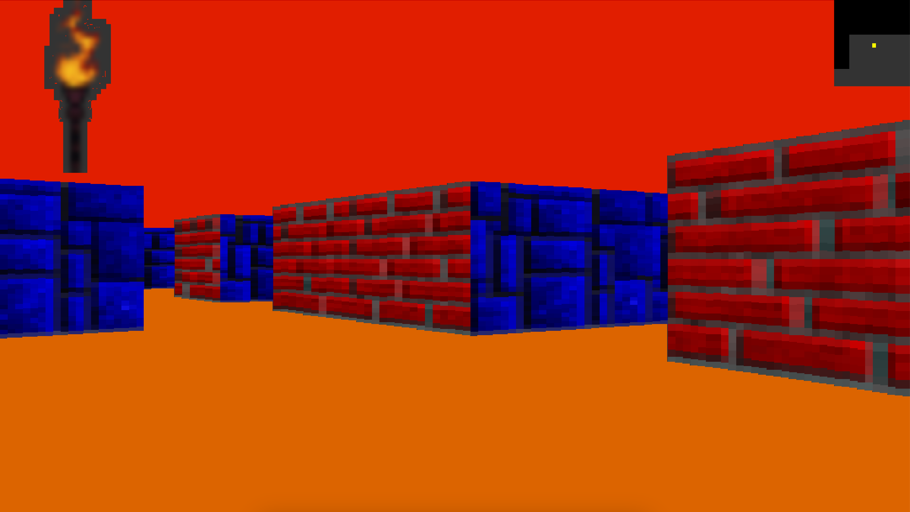

```text
        :::      ::::::::
      :+:      :+:    :+:
    +:+ +:+         +:+
  +#+  +:+       +#+
+#+#+#+#+#+   +#+
     #+#    #+#
    ###   ########.fr
```
# Cub3D

**Mon premier RayCaster avec la minilibX**




## 📝 Description

Cub3D est un projet de l'École 42 inspiré du jeu **Wolfenstein 3D**, considéré comme le premier FPS de l’histoire du jeu vidéo.  
L’objectif est d’implémenter un **moteur graphique en 3D subjective** à l’aide de la technique du **ray-casting**.  
Le projet permet d’explorer les mathématiques appliquées aux jeux vidéo et de développer des compétences en programmation graphique avec **la minilibX**.

## 🎯 Objectifs

Ce projet met en avant plusieurs compétences essentielles :
- **Programmation système en C** (gestion de la mémoire, des fichiers et des événements).
- **Mathématiques appliquées** (trigonométrie, projections 2D en 3D).
- **Gestion graphique** avec **la minilibX**.
- **Optimisation et structuration du code** pour un rendu en temps réel fluide.
- **Gestion des événements** (clavier, souris, interactions).

## 🚀 Fonctionnalités Clés

- **Affichage 3D en vue subjective** basé sur le **ray-casting**.
- **Chargement et parsing de cartes (`.cub`)** pour générer l’environnement du jeu.
- **Déplacements du joueur** :
  - `Z, Q, S, D` : Déplacement avant/arrière et latéral.
  - `←, →` : Rotation de la caméra.
  - `ESC` : Quitter proprement.
  - Clic sur la croix rouge : Fermeture propre du programme.
- **Gestion des textures** pour représenter les murs selon leur orientation (**Nord, Sud, Est, Ouest**).
- **Coloration dynamique du sol et du plafond**.
- **Gestion correcte des fenêtres et des événements utilisateur**.

## 🎮 Map et Format `.cub`

- Une carte est composée uniquement des caractères suivants :
  - `0` : Espace vide.
  - `1` : Mur.
  - `N, S, E, W` : Position de départ du joueur + orientation.
- **Exemple de map valide** :
  ```
  111111
  100101
  101001
  1100N1
  111111
  ```
- Le fichier `.cub` inclut aussi les textures et les couleurs du sol/plafond :
  ```
  NO ./path_to_the_north_texture
  SO ./path_to_the_south_texture
  WE ./path_to_the_west_texture
  EA ./path_to_the_east_texture

  F 220,100,0
  C 225,30,0
  ```

## 💡 Défis Techniques

- **Algorithme de Ray-Casting** : Détection de collision et rendu en 3D à partir d’une carte 2D.
- **Gestion de la minilibX** : Fenêtre, événements clavier/souris, affichage d’images.
- **Parsing avancé** : Lecture et validation du fichier `.cub`, gestion des erreurs.
- **Optimisation du rendu** : Minimisation des calculs pour un affichage fluide.

## 🔥 Bonus Possibles

Si la partie obligatoire est **parfaitement réalisée**, voici quelques améliorations envisageables :
- ✅ **Minimap interactive** affichant la position du joueur.
- ✅ **Détection des collisions** contre les murs.
- ✅ **Portes ouvrables et fermables**.
- ✅ **Sprites animés** (ex : ennemis, objets interactifs).
- ✅ **Rotation de la caméra avec la souris**.
- ✅ **Effets graphiques avancés** (ombres, HUD, barre de vie).

## 📂 Organisation des Fichiers

- `srcs/` : Contient le code source principal.
- `includes/` : Définitions des structures et des prototypes.
- `maps/` : Contient les fichiers `.cub` pour tester différentes configurations.
- `textures/` : Contient les images utilisées pour les murs.
- `Makefile` : Script pour compiler le projet facilement.

## 🔧 Prérequis & Installation

### **1. Prérequis**
- **Installer Homebrew (macOS uniquement) :**
  ```bash
  /bin/bash -c "$(curl -fsSL https://raw.githubusercontent.com/Homebrew/install/HEAD/install.sh)"
  ```
- **Installer la minilibX :**
  ```bash
  brew install minilibx
  ```
- **Installer la lib math (`-lm`) si nécessaire** :
  ```bash
  sudo apt install libm-dev   # (Linux uniquement)
  ```

### **2. Installation**
- **Cloner le projet** :
  ```bash
  git clone https://github.com/LcntJulien/42-Cub3D.git
  ```
- **Compiler et exécuter** :
  ```bash
  cd 42-Cub3D
  make
  ./cub3D maps/map.cub
  ```